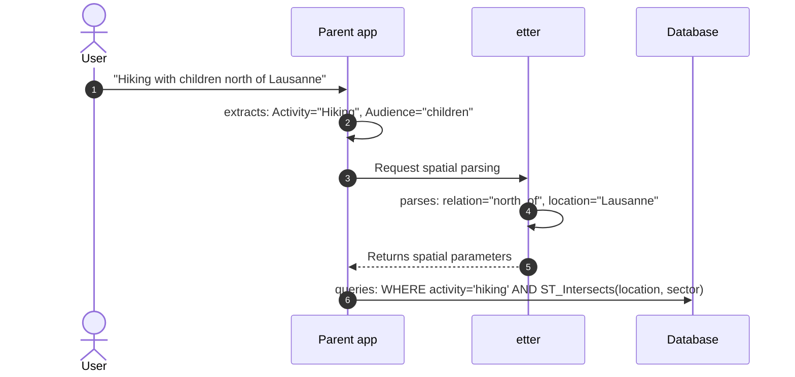

# Getting Started

## What is etter?

**etter** (/ˈɛtɐ/, Swiss German) — the boundary marking the edge of a village or commune.

etter transforms natural language location queries into structured geographic filters. It uses LLMs to understand multilingual queries and extract spatial relationships, returning typed Pydantic models your application can act on.

**Key principle:** etter has one responsibility — extract the geographic filter. It does not identify features, filter attributes, or execute searches.



## Installation

```bash
pip install etter
```

With PostGIS datasource support:

```bash
pip install etter[postgis]
```

## Quick Start

```python
from langchain_openai import ChatOpenAI
from etter import GeoFilterParser
import os

llm = ChatOpenAI(model="gpt-4o", temperature=0, api_key=os.getenv("LLM_API_KEY"))

parser = GeoFilterParser(llm=llm)
result = parser.parse("north of Lausanne")

print(result.spatial_relation.relation)       # "north_of"
print(result.reference_location.name)         # "Lausanne"
print(result.buffer_config.distance_m)        # 10000
print(result.confidence_breakdown.overall)    # 0.95
```

See [`GeoFilterParser`](../api/etter.html#GeoFilterParser) for the full constructor signature and options.

## Confidence and Strict Mode

By default etter warns on low confidence. Use `strict_mode=True` to raise instead:

```python
# Lenient: emits LowConfidenceWarning below threshold
parser = GeoFilterParser(llm=llm, confidence_threshold=0.6, strict_mode=False)

# Strict: raises LowConfidenceError below threshold
parser = GeoFilterParser(llm=llm, confidence_threshold=0.8, strict_mode=True)
```

See [`GeoQuery`](../api/etter.html#GeoQuery) for a full description of all output fields.

## Async parsing

Inside an event loop (e.g. a FastAPI handler), use the async counterpart `aparse` so the LLM call does not block other requests:

```python
geo_query = await parser.aparse("north of Lausanne")
```

`aparse` returns the same `GeoQuery` as `parse`; it differs only in that it awaits `ainvoke` on the underlying LLM. See [`aparse`](../api/etter.html#GeoFilterParser.aparse).

## Streaming

For responsive UIs, use `parse_stream` to receive reasoning events in real time:

```python
async for event in parser.parse_stream("5km north of Lausanne"):
    if event["type"] == "reasoning":
        print(event["content"])           # e.g. "Identified relation: north_of"
    elif event["type"] == "data-response":
        geo_query = event["content"]      # raw dict (GeoQuery fields)
    elif event["type"] == "error":
        raise RuntimeError(event["content"])
```

See [`parse_stream`](../api/etter.html#GeoFilterParser.parse_stream) for all event types.

## Custom Spatial Relations

Register additional relations beyond the 15 built-ins:

```python
from etter import SpatialRelationConfig, RelationConfig

config = SpatialRelationConfig()
config.register_relation(RelationConfig(
    name="close_to",
    category="buffer",
    description="Very close proximity",
    default_distance_m=1000,
    buffer_from="center",
    ring_only=False,  # Exclude reference feature for ring buffers
    side=None,        # "left" or "right" for one-sided buffers
    sector_angle_degrees=None,  # For custom directional sectors
    direction_angle_degrees=None,  # Direction in degrees (0=N, 90=E, 180=S, 270=W)
))

parser = GeoFilterParser(llm=llm, spatial_config=config)
```

See [Spatial Relations](/guide/spatial-relations) for the full list of built-ins and configuration options.

## Additional Instructions

Pass `additional_instructions` to inject caller-specific rules into the prompt without forking the default system prompt. The text is added as a system message after the main prompt and before the few-shot examples.

Typical uses: region-specific endonyms, domain aliases, or organization-specific place names.

```python
parser = GeoFilterParser(
    llm=llm,
    additional_instructions=(
        "This application serves Swiss users. "
        "'Lac Léman' and 'Lake Geneva' both refer to the same body of water. "
        "Prefer the French endonym when the query is in French."
    ),
)
```
